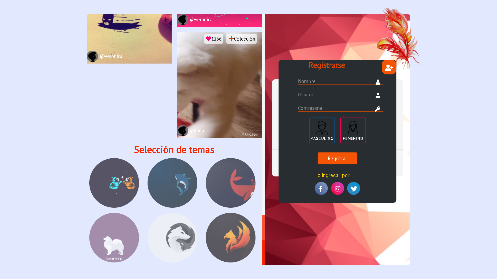

# Tnx Template

------------
Plantilla desarrollada en pug, sass y js.

```bash
    :v
    Plex
```

Capturas
-------

__Vista__
<center>
    
</center>

__Vista__
<center>
    
</center>

__Vista__
<center>
    
</center>

__Vista__
<center>
    
</center>

__Vista__
<center>
    
</center>

__Vista__
<center>
    
</center>

__Vista__
<center>
    
</center>

